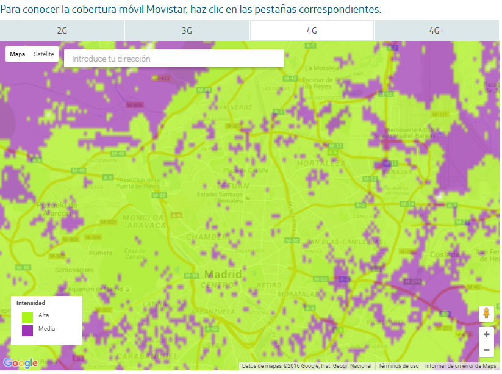
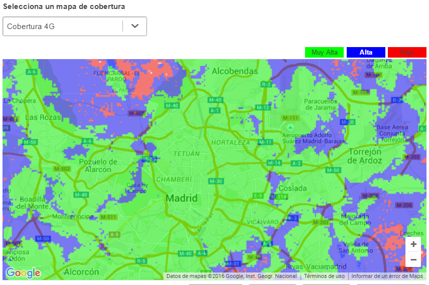
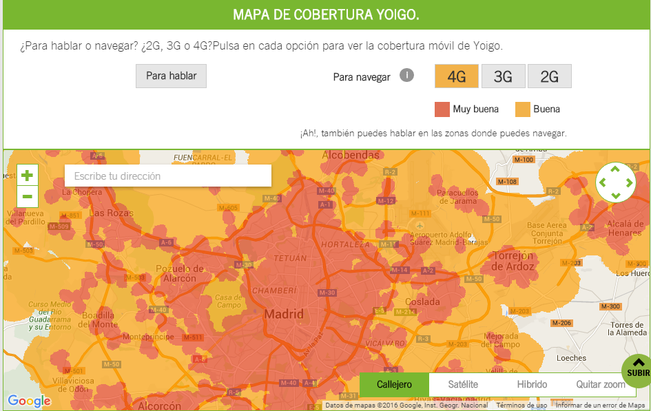

```{r libraries, message=FALSE, warning=FALSE, include=FALSE}
#Clear workspace
rm(list=ls())

# ########################################################################
# #                      LOAD LIBRARIES
# ########################################################################
if (!require("pacman")) install.packages("pacman")
pacman::p_load("jsonlite", 
               "maptools", 
               "raster",
               "rgeos",
               "rgdal",
               "leaflet",
               "ggplot2",
               "Compind",
               "scales",
               "plyr", 
               "dplyr", #Always load plyr before dplyr
                "reshape2",
               "corrgram",
               "ggmap",
               "png",
               "sp",
               "gstat",
               "automap",
               "plotly",
               "DT")

#Replace working directory with the one where you downloaded the data
# setwd("~/Google Drive/Weplan_BI_reports/Data/Raw/open_signal")
```

```{r functions, message=FALSE, warning=FALSE, include=FALSE}

## A helper function that tests whether an object is either NULL _or_ 
## a list of NULLs
is.NullOb <- function(x) is.null(x) | all(sapply(x, is.null))

## Recursively step down into list, removing all such objects 
rmNullObs <- function(x) {
  x <- Filter(Negate(is.NullOb), x)
  lapply(x, function(x) if (is.list(x)) rmNullObs(x) else x)
}
```
<br></br>

#### **Introduction:**

In Spain there are four mobile network operators (MNO) Movistar, Vodafone, Orange and Yoigo with their own network towers and over twenty mobile virtual network operator (MVNO) that rent their towers from the MNO.

When choosing a mobile plan costumers are used to comparing prices taking into account the allowances of the mobile plans: 

<center>  </center>

<br></br>

<center>  </center> 

<br></br>

There are in fact many platforms that help the clients choose their mobile plan such as web comparison engines or even smartphone apps that take into account the users usage when choosing the right plan.

Even though costumer can grasp what minutes, sms, data and quota, can they take into account the quality of the network?

  We have to understand that even though the characteristic of a plan can be the same in the whole of Spain (20GB of data for example) the network quality won’t be the same in the entire territory.

Looking into the webs of MNO I found that answering the question of which Operator has  the best coverage in my home city would not be answered by them because they don’t use a common value to express the quality.

<br></br>


<br></br>

Movistar gives two indicator “Alta” and “Media” which translates into high and medium.

<br></br>


<br></br>

Vodafone gives three indicators, “Muy alta”, “Alta” and “Baja” which translates into Very high, high and low.

<br></br>


<br></br>

Orange gives one indicator that shows the 4G coverage

<br></br>


<br></br>

Yoigo just gives two indicators on 4G "muy buena" and "buena" which translates into very good and good.

<br></br>

#### **Objective of the project**:

The purpose of this project is to answer the question of which operator has the best coverage in Madrid. In order to do this we need to develop a common index that will indicate the quality of the network taking into account the different variables.

The code is reusable in the sense that by modifying certain parts we can replicate the same process for any other city.

<br></br>

#### **Previous works and information**:

There are many articles that speak of the best coverage at a macro level in Spain:

http://www.ocu.org/tecnologia/internet-telefonia/noticias/red-operadores-moviles#
https://www.youtube.com/watch?time_continue=22&v=pm-fTiVv5Rk
http://www.eleconomista.es/telecomunicaciones-tecnologia/noticias/7631596/06/16/La-cobertura-4G-llegara-a-mas-del-95-de-la-poblacion-espanola-a-final-de-ano.html


It is interesting that there is no information city by city, and recently there have been press releases where Vodafone and Orange are promoting they will have internet access in the underground which is a promotion of their services at a local level (only cities with underground transportation). 

http://sabemos.es/2016/06/08/orange-vodafe-internet-datos_19455/

http://cincodias.com/cincodias/2016/06/07/empresas/1465324100_531759.html

There are a report created by the Spanish competition market regulator “Comisión Nacional de los Mercados y la Competencia” (CNMC) that relate to the coverage and LTE (4G) in Spain:

http://data.cnmc.es/datagraph/files/Informe%20Telecomunicaciones%20CNMC%202014.pdf

https://www.cnmc.es/Portals/0/Ficheros/Telecomunicaciones/Resoluciones/2015/1512_Diciembre/201512_INF-DTSA-184-15.pdf

Curiously enough the CNMC during the years 2011, 2012 and 2014 released on their forum coverage maps and reports on their blog:

2011:https://blog.cnmc.es/2011/02/10/mapa-de-la-cobertura-3gumts-en-espana/

2012: https://blog.cnmc.es/2011/02/10/mapa-de-la-cobertura-3gumts-en-espana/

2014:https://blog.cnmc.es/2014/10/14/mapas-de-la-cobertura-3g-y-4g-en-espana-2013/

<br></br>

#### **Data source:**

I tried searching for public databases from the Spanish MNO related to coverage but there are none. The Spanish competition market regulator “Comisión Nacional de los Mercados y la Competencia” (CNMC) does have public data bases http://opendata.cnmc.es/ but none related to coverage.

This is why I decided to use public information from Open Signal, http://opensignal.com/. A free app for Android and IOS that through their users acquire coverage information. 

They have an open API with the following limitations:

<br></br>

#### **Request and commercial use**

*Our API is strictly for non-commercial use and is rate limited to a maximum of 5 requests per minute and 2000 requests per month.*

<br></br>

####  **Data storage**

*Users may not use the Open Signal API to aggregate, cache or store any of the data provided by the API. All API Content used must be retrieved in real-time, in accordance with the usage limits in place on your account.*
For the sake of complying with the API terms of service I will not provide the database used in this report and the database will be limited with the data produced by 2000 request to the API. 

<br></br>

####  **API registration**

If the reader wishes to replicate the process for another city a new API KEY is necessary. Go to http://developer.opensignal.com/, register and change the API key in the code bellow.

<br></br>

#### **Extraction Method and spacial information**

The API needs latitude and longitude in order to return values, so the first thing we are going to do is create 2000 random points in Madrid. 

In order to do this we need to delimit Madrid with a shapefile of spanish cities downloaded from gadm.org. 

Then we are going to request these points from the API, one point for every 14 seconds in order to comply with the 5 request per minute. 

We are also loading the spatial information of the postal codes of Madrid in order to delimit the city.
<br></br>

```{r extract data from Open Signal, message=FALSE, warning=FALSE}
#########################################################################
##                      EXTRACT DATA FROM OPEN SIGNAL
#########################################################################
##                      LOAD Shapefiles and Data


#Instructions: Uncomment this chunk to extract data from opensignal
#Replace "APIKEY" at the end of the fromJSON command with the api key obtained in
#developers url: 

#Load shapefile of Spanish Cities
#Downloaded from gadm.org
#Type 4 is for cities
spanish.cities.shp <- readShapeSpatial("~/Google Drive/Weplan_BI_reports/Data/Raw/open_signal/ESP_adm4.shp")

# proj4string(coords) <-  CRS("+proj=longlat +datum=WGS84")
#Extract Madrid province shapefile
mad.provin.shp <- spanish.cities.shp[spanish.cities.shp$NAME_2 == "Madrid",]
#List all municipalities in Madrid
# unique(mad.provin.shp@data$NAME_4)
#Get a shapefile of Madrid city
mad.city.shp <- spanish.cities.shp[spanish.cities.shp$NAME_4 == "Madrid",]
#Get postal codes
mad.city.postal.shp <- readShapeSpatial("~/Google Drive/Weplan_BI_reports/Data/Raw/open_signal/CODIGO_POSTAL.shp")  

# Only keep madrid city postal codes
mad.postal.codes <- c("28001","28002","28003","28004","28005","28006","28007","28008","28009","28010","28011","28012","28013","28014","28015","28016","28017","28018","28019","28020","28021","28022","28023","28024","28025","28026","28027","28028","28029","28030","28031","28032","28033","28034","28035","28036","28037","28038","28039","28040","28041","28042","28043","28044","28045","28046","28047","28048","28049","28050","28051","28052","28053","28054","28055","28070","28071","28080","28082","28083","28085","28086","28087")
mad.city.postal.shp <- mad.city.postal.shp[mad.city.postal.shp$COD_POSTAL %in% mad.postal.codes,]


# #Plot the shapefile
# plot(mad.city.shp, col = "grey", axes = TRUE)
# 
# 
# #Sample points from shapefile
# set.seed(1986)
# 
# x <- spsample(mad.city.shp, n = 1700, "random") # select n random points within polygon
# proj4string(coords) <- CRS("+init=epsg:4326")
# 
# #Basic Plot shapefile and points
# plot(mad.city.shp) #Plot Madrid Shapefile
# points(x)
# 
# #Add visualization of random points in Madrid using leaflet
# leaflet(x) %>% addTiles() %>% setView(mean(x$x), mean(x$y), zoom = 13) %>%
#   addCircleMarkers(lng = x$x, lat = x$y,
#                    radius = 3,
#                    stroke = FALSE,
#                    fillOpacity = 0.5)
# 
# #Extract pairs of longitude (col1) and latitude (col2) from random points
# spatial.points.matrix <- x@coords


# #Create a loop to iterate over the random locations and extract data from Open Signal API
# pages <- list() #Create empty list
# for(i in 1:nrow(spatial.points.matrix)) #Initiate loop from 1 to last row of matrix with locations
# {
#   #paste strings structure: url+lat+long+distance+json_format+apikey
#   mydata <- fromJSON((paste("http://api.opensignal.com/v2/networkstats.json?lat=",
#                                                           spatial.points.matrix[i,2],
#                                                           "&lng=",spatial.points.matrix[i,1],
#                                                           "&distance=1&json_format=2&apikey=APIKEY",
#                                                           sep= "")), flatten = TRUE)
#   message("Retrieving page ", i)
#   mydata <- rmNullObs(mydata)
#   pages[[i+1]] <- mydata
#   Sys.sleep(14)
# }
# #Save RDS data
# saveRDS(pages, "./madrid_data_2000.rds")


```

<br></br>

#### **Database**

The database we have created is made out of a Json composed of lists and data frames. In order to be able to use most R functions, the data is required to have a single observation per row and column. The challenge was flattening the data structure. 

<br></br>

```{r load data, echo=TRUE, message=FALSE, warning=FALSE}
#Load data
madrid.data <- readRDS("~/Google Drive/Weplan_BI_reports/Data/Raw/open_signal/madrid_data_2000.rds")
#Remove null elements in lists
madrid.data <- rmNullObs(madrid.data)
#Convert lists in the list to dataframe
dfs.madrid.data <- lapply(madrid.data, data.frame, stringsAsFactors = FALSE)

#Use plyr to bind rows in a dataframe filling blanks with NAs
df.madrid.data <- rbind.fill(dfs.madrid.data)
```

<br></br>

#### **Data treatment**

The first thing we are going to do is change the variable names so the are easier to use and also change the values to numeric.

<br></br>

```{r data munging, echo=TRUE, message=FALSE, warning=FALSE}
names(df.madrid.data)[names(df.madrid.data)=="networkRank.networkName"] <- "carrier"
names(df.madrid.data)[names(df.madrid.data)=="networkRank.type4G.networkType"] <- "type4G.network.type"
names(df.madrid.data)[names(df.madrid.data)=="networkRank.type4G.averageRsrpAsu"] <- "type4G.averageRsrpAsu"
names(df.madrid.data)[names(df.madrid.data)=="networkRank.type4G.sampleSizeSpeed"] <- "type4G.sampleSizeSpeed"
names(df.madrid.data)[names(df.madrid.data)=="networkRank.type4G.sampleSizeRSRP"] <- "type4G.sampleSizeRSRP"
names(df.madrid.data)[names(df.madrid.data)=="networkRank.type4G.averageRsrpDb"] <- "type4G.averageRsrpDb"
names(df.madrid.data)[names(df.madrid.data)=="networkRank.type4G.downloadSpeed"] <- "type4G.downloadSpeed"
names(df.madrid.data)[names(df.madrid.data)=="networkRank.type4G.uploadSpeed"] <- "type4G.uploadSpeed"
names(df.madrid.data)[names(df.madrid.data)=="networkRank.type4G.pingTime"] <- "type4G.pingTime"
names(df.madrid.data)[names(df.madrid.data)=="networkRank.type4G.reliability"] <- "type4G.reliability"
names(df.madrid.data)[names(df.madrid.data)=="networkRank.type3G.networkType"] <- "type3G.network.type"
names(df.madrid.data)[names(df.madrid.data)=="networkRank.type3G.averageRssiAsu"] <- "type3G.averageRssiAsu"
names(df.madrid.data)[names(df.madrid.data)=="networkRank.type3G.averageRssiDb"] <- "type3G.averageRssiDb"
names(df.madrid.data)[names(df.madrid.data)=="networkRank.type3G.sampleSizeRSSI"] <- "type3G.sampleSizeRSSI"
names(df.madrid.data)[names(df.madrid.data)=="networkRank.type3G.downloadSpeed"] <- "type3G.downloadSpeed"
names(df.madrid.data)[names(df.madrid.data)=="networkRank.type3G.uploadSpeed"] <- "type3G.uploadSpeed"
names(df.madrid.data)[names(df.madrid.data)=="networkRank.type3G.pingTime"] <- "type3G.pingTime"
names(df.madrid.data)[names(df.madrid.data)=="networkRank.type3G.reliability"] <- "type3G.reliability"
names(df.madrid.data)[names(df.madrid.data)=="networkRank.type3G.sampleSizeSpeed"] <- "type3G.sampleSizeSpeed"
names(df.madrid.data)[names(df.madrid.data)=="networkRank.type2G.networkType"] <- "type2G.network.type"
names(df.madrid.data)[names(df.madrid.data)=="networkRank.type2G.averageRssiAsu"] <- "type2G.averageRssiAsu"
names(df.madrid.data)[names(df.madrid.data)=="networkRank.type2G.averageRssiDb"] <- "type2G.averageRssiDb"
names(df.madrid.data)[names(df.madrid.data)=="networkRank.type2G.sampleSizeRSSI"] <- "type2G.sampleSizeRSSI"
names(df.madrid.data)[names(df.madrid.data)=="networkRank.type2G.downloadSpeed"] <- "type2G.downloadSpeed"
names(df.madrid.data)[names(df.madrid.data)=="networkRank.type2G.uploadSpeed"] <- "type2G.uploadSpeed"
names(df.madrid.data)[names(df.madrid.data)=="networkRank.type2G.pingTime"] <- "type2G.pingTime"
names(df.madrid.data)[names(df.madrid.data)=="networkRank.type2G.reliability"] <- "type2G.reliability"
names(df.madrid.data)[names(df.madrid.data)=="networkRank.type2G.sampleSizeSpeed"] <- "type2G.sampleSizeSpeed"


to.numeric <- c("latitude", "longitude",  
                "type4G.network.type", "type4G.averageRsrpAsu",
                "type4G.averageRsrpDb", "type4G.sampleSizeRSRP",
                "type4G.downloadSpeed", "type4G.uploadSpeed", "type4G.pingTime",
                "type4G.reliability", "type4G.sampleSizeSpeed",
                "type3G.network.type", "type3G.averageRssiAsu",
                "type3G.averageRssiDb", "type3G.sampleSizeRSSI",
                "type3G.downloadSpeed", "type3G.uploadSpeed",
                "type3G.pingTime", "type3G.reliability", "type3G.sampleSizeSpeed",
                "type2G.network.type", "type2G.averageRssiAsu",
                "type2G.averageRssiDb", "type2G.sampleSizeRSSI",
                "type2G.downloadSpeed", "type2G.uploadSpeed",
                "type2G.pingTime", "type2G.reliability", "type2G.sampleSizeSpeed")


df.madrid.data[to.numeric] <- lapply(df.madrid.data[to.numeric], function(i)  as.numeric(i))

cols.to.be.selected <- append(to.numeric, c("carrier"))

df.madrid.data <- df.madrid.data[cols.to.be.selected] %>%
  filter(!is.na(carrier))

# str(df.madrid.data)
# summary(df.madrid.data)


```


<br></br>
```{r summarise, echo=FALSE, message=FALSE, warning=FALSE}

df.madrid.data.sum.carrier <- df.madrid.data %>%
  group_by(carrier) %>%
  summarise(obs = n())

#First summarise
df.madrid.data.sum.carrier <- df.madrid.data %>%
  group_by(carrier) %>%
  summarise(type4G.downloadSpeed = mean(type4G.downloadSpeed, na.rm = T),
            type3G.downloadSpeed = mean(type3G.downloadSpeed, na.rm = T),
            type4G.uploadSpeed = mean(type4G.uploadSpeed, na.rm = T),
            type3G.uploadSpeed = mean(type3G.uploadSpeed, na.rm = T),
            type4G.pingTime = mean(type4G.pingTime, na.rm = T),
            type3G.pingTime = mean(type3G.pingTime, na.rm = T),
            type4G.reliability = mean(type4G.reliability, na.rm = T),
            type3G.reliability = mean(type3G.reliability, na.rm = T))
  
```

#### **Data Variables** 

The problem we have right know is that we have different variables that we have to correlate if we want to understand the coverage quality. This is why we are going to try to unify all of the values into a single one.

<br></br>

```{r Data table with variables, echo=FALSE, message=FALSE, warning=FALSE}

df.m <- melt(df.madrid.data.sum.carrier, id.var = "carrier") %>% #first melt
  mutate(network = gsub("^type3G.*", "3G", variable),
         network = gsub("^type4G.*", "4G", network)) %>%
  mutate(var = gsub("^type3G.", "", variable),
         var = gsub("^type4G.", "", var)) %>%
  select(carrier, network, var, value) %>%
  dcast(carrier + network ~ var)

datatable(df.m, 
          filter = 'top',
          rownames = FALSE,
          caption = 'Table: Average value of Variables',
          options = list(pageLength = 20, autoWidth = TRUE),
          colnames = c('Carrier',"Network", 
                       "Download Speed","Upload Speed", "Ping Time",
                       "Reliability")) %>% 
  formatRound(c('downloadSpeed',"uploadSpeed","pingTime", "reliability"), 2)

```

<br></br>

#### **These are the variables that we have**:

- Network_type: 2G, 3G or 4G

- Latitude & Longitude: This is the location

- DownloadSpeed: The download speed in kbps

- UploadSpeed: The upload speed in kpbs

- PingTime: The average ping time in milliseconds

- Reliability: The percentage reliability, measure from 0 (0%) to 1 (100%). This is a measure of the proportion of time that a data connection is possible

- AverageRssiDb: The average RSSI, in dBm

- AverageRsrpDb: The average Rsrp, in dBm

<br></br>

#### **Interpretation of values of RSSI**

On a scale of 0 to 80 RSSI:

- 0: Ideal signal, difficult to achieve in reality.

- 40 to -60: Very stable signal transfer rates.

- 60: Good link, you may achieve a stable connection of up to 80%.

- 70: Normal link; although it may suffer problems with rain and wind.

- 80: It is the minimum acceptable signal to establish a connection; resulting in a loss of communication (call loss, loss of data, messages (SMS) corrupt or unreadable.

<br></br>

#### **visual representation of variables**

Let's inspect the variables through visual representacion.

<br></br>

```{r barchart, plotly=TRUE, results='asis', echo=FALSE, message=FALSE, warning=FALSE}
#Bar plot speeds
dt.long <- melt(df.madrid.data.sum.carrier, 
                id.vars=c("carrier")) %>%
  filter(variable %in% c("type4G.downloadSpeed", "type4G.uploadSpeed"))

bar <- ggplot(dt.long, 
       aes(x=carrier, y=value, fill=variable)) + 
  geom_bar(position = "dodge", stat='identity') + 
  xlab("") + 
  ylab("") + 
  theme_minimal()  +
  labs(fill="", title = "Connections Average Speed") 

# ggplotly()
```

<br></br>

```{r boxplot downloadspeed, plotly=TRUE, results='asis', echo=FALSE, message=FALSE, warning=FALSE}

#Boxplot
group.colors <- c(Orange = "orange", Vodafone = "orangered3",
                  Movistar ="cadetblue", Yoigo = "darkorchid")

#Plot downlad speed
m <- ggplot(df.madrid.data %>%
              filter(!is.na(type4G.downloadSpeed)), 
            aes(x = carrier, y = `type4G.downloadSpeed`, color = carrier)) 
m + geom_boxplot() +
  geom_jitter(alpha = 0.2) + 
  theme_minimal() +
  xlab("") + ylab("bytes?") +
  # ggtitle("Primer Trimestre 2016") +
  theme(legend.position="none") +
  scale_color_manual(values = group.colors) +
  stat_summary(fun.y=mean, geom = "point", shape=18, size = 4) +
  labs(title = "4G Download Speeds by carrier") 

# ggplotly()
```

<br></br>

```{r boxplot ping, plotly=TRUE, results='asis', echo=FALSE, message=FALSE, warning=FALSE}

#Boxplot
group.colors <- c(Orange = "orange", Vodafone = "orangered3",
                  Movistar ="cadetblue", Yoigo = "darkorchid")


#Plot pingtime
m <- ggplot(df.madrid.data %>%
              filter(!is.na(type4G.pingTime)), 
            aes(x = carrier, y = `type4G.pingTime`, color = carrier)) 
m + geom_boxplot() +
  geom_jitter(alpha = 0.2) + 
  theme_minimal() +
  xlab("") + ylab("pingtime 4g") +
  # ggtitle("Primer Trimestre 2016") +
  theme(legend.position="none") +
  scale_color_manual(values = group.colors) +
  stat_summary(fun.y=mean, geom = "point", shape=18, size = 4) +
  labs(title = "4G Ping by carrier") 

# ggplotly()
```

<br></br>

```{r boxplot reliability, plotly=TRUE, results='asis', echo=FALSE, message=FALSE, warning=FALSE}

#Boxplot
group.colors <- c(Orange = "orange", Vodafone = "orangered3",
                  Movistar ="cadetblue", Yoigo = "darkorchid")

#Plot RELIABILITY
m <- ggplot(df.madrid.data %>%
              filter(!is.na(type4G.reliability)), 
            aes(x = carrier, y = `type4G.reliability`, color = carrier)) 
m + geom_boxplot() +
  geom_jitter(alpha = 0.2) + 
  theme_minimal() +
  xlab("") + ylab("Reliability 4g") +
  # ggtitle("Primer Trimestre 2016") +
  theme(legend.position="none") +
  scale_color_manual(values = group.colors) +
  stat_summary(fun.y=mean, geom = "point", shape=18, size = 4) +
  labs(title = "4G Reliability by carrier") 

# ggplotly()
```

<br></br>


#### **Method used to create an index**

In order to simplify the information we will correlate the variables into a common index that we will determine through Factor analysis (FA) which is similar to PCA. It aims to describe a set of Q variables x1, x2 ,..., xQ in terms of a smaller number of m factors and to highlight the relationship between these variables. However, while PCA is based simply on linear data combinations, FA is based on a rather special model. Contrary to the PCA, the FA model assumes that the data is based on the underlying factors of the model, and that the data variance can be decomposed into that accounted for by common and unique factors.

<br></br>

```{r create composite index, echo=TRUE, message=FALSE, warning=FALSE}
#Methodology: https://www.oecd.org/std/42495745.pdf
# Library for the methodology: Compind

#Create absolute value for normalization
df.madrid.data <- df.madrid.data %>%
  mutate(type2G.averageRssiDb.abs = abs(type2G.averageRssiDb),
        type3G.averageRssiDb.abs = abs(type3G.averageRssiDb),
         type4G.averageRsrpDb.abs = abs(type4G.averageRsrpDb)) 


#########################################################################
##                      2G
#########################################################################


#Filter 2G variables and remove missing values
df.2g.nonmissing <- df.madrid.data %>% 
                    dplyr::select(latitude, longitude, carrier, type2G.downloadSpeed,
                                  type2G.uploadSpeed, type2G.reliability, 
                                  type2G.pingTime, type2G.averageRssiDb.abs) %>%
  filter(!is.na(type2G.uploadSpeed))

#Estimate composite index after normalization
data_norm <- normalise_ci(df.2g.nonmissing,c(4:8),polarity = c("POS","POS","POS","NEG", "POS"), method=2)
CI_Factor_estimated <- ci_factor(data_norm$ci_norm, c(1:5),method="CH", dim=3)

#Bind composite index to the previous df for joining with master df (df.madrid.data)
df.2g.nonmissing <- cbind(df.2g.nonmissing, CI_Factor_estimated$ci_factor_est)
names(df.2g.nonmissing)[names(df.2g.nonmissing)=="CI_Factor_estimated$ci_factor_est"] <- "ci.2g"

df.2g.nonmissing <- df.2g.nonmissing %>% 
                    dplyr::select(carrier, latitude, longitude, ci.2g)

#Join 2g index with master db

df.madrid.data <- left_join(df.madrid.data, 
                            df.2g.nonmissing,
                            by = c("latitude" = "latitude",
                                   "longitude" = "longitude",
                                   "carrier" = "carrier"))


#########################################################################
##                      3G
#########################################################################


#Filter 3G variables and remove missing values
df.3g.nonmissing <- df.madrid.data %>% 
                    dplyr::select(latitude, longitude, carrier, type3G.downloadSpeed,
                                  type3G.uploadSpeed, type3G.reliability, 
                                  type3G.pingTime, type3G.averageRssiDb.abs) %>%
  filter(!is.na(type3G.uploadSpeed))

#Estimate composite index after normalization
data_norm <- normalise_ci(df.3g.nonmissing,c(4:8),polarity = c("POS","POS","POS","NEG", "POS"), method=2)
CI_Factor_estimated <- ci_factor(data_norm$ci_norm, c(1:5),method="CH", dim=3)

#Bind composite index to the previous df for joining with master df (df.madrid.data)
df.3g.nonmissing <- cbind(df.3g.nonmissing, CI_Factor_estimated$ci_factor_est)
names(df.3g.nonmissing)[names(df.3g.nonmissing)=="CI_Factor_estimated$ci_factor_est"] <- "ci.3g"

df.3g.nonmissing <- df.3g.nonmissing %>% 
                    dplyr::select(carrier, latitude, longitude, ci.3g)

#Join 3g index with master db

df.madrid.data <- left_join(df.madrid.data, 
                            df.3g.nonmissing,
                            by = c("latitude" = "latitude",
                                   "longitude" = "longitude",
                                   "carrier" = "carrier"))

#Check index correlations with rest of indicators
# library(corrgram)
# corrgram(df.3g.nonmissing %>%
#            select(-latitude, -longitude, -carrier))


#########################################################################
##                      4G
#########################################################################
#Filter 3G variables and remove missing values
df.4g.nonmissing <- df.madrid.data %>% 
                    dplyr::select(latitude, longitude, carrier, type4G.downloadSpeed,
                                  type4G.uploadSpeed, type4G.reliability, 
                                  type4G.pingTime, type4G.averageRsrpDb.abs) %>%
  filter(!is.na(type4G.uploadSpeed))

#Estimate composite index
data_norm <- normalise_ci(df.4g.nonmissing,c(4:8),polarity = c("POS","POS","POS","NEG", "POS"), method=2)
CI_Factor_estimated <- ci_factor(data_norm$ci_norm, c(1:5),method="CH", dim=3)

#Bind composite index to the previous df for joining with master df (df.madrid.data)
df.4g.nonmissing <- cbind(df.4g.nonmissing, CI_Factor_estimated$ci_factor_est)
names(df.4g.nonmissing)[names(df.4g.nonmissing)=="CI_Factor_estimated$ci_factor_est"] <- "ci.4g"

df.4g.nonmissing <- df.4g.nonmissing %>% 
                    dplyr::select(carrier, latitude, longitude, ci.4g)

#Join 4g index with master db

df.madrid.data <- left_join(df.madrid.data, 
                            df.4g.nonmissing,
                            by = c("latitude" = "latitude",
                                   "longitude" = "longitude",
                                   "carrier" = "carrier"))

#Summarise by carrier
df.madrid.data.sum.carrier <- df.madrid.data %>%
  group_by(carrier) %>%
  summarise(ci.2g = mean(ci.2g, na.rm = T),
            ci.3g = mean(ci.3g, na.rm = T),
            ci.4g = mean(ci.4g, na.rm = T))

```
<br></br>

Now that we have created the index lets look at the average values:

<br></br>
```{r Data table with average index, echo=FALSE, message=FALSE, warning=FALSE}

#Summarise by carrier
df.madrid.data.sum.carrier.ci <- df.madrid.data %>%
  group_by(carrier) %>%
  summarise(ci.2g = mean(ci.2g, na.rm = T),
            ci.3g = mean(ci.3g, na.rm = T),
            ci.4g = mean(ci.4g, na.rm = T))

datatable(df.madrid.data.sum.carrier.ci)

```
<br></br>

```{r heatmap of points density by location, message=FALSE, warning=FALSE, include=FALSE}
#Summarise by location
df.madrid.data.sum.loc <- df.madrid.data %>%
  group_by(latitude, longitude) %>%
  summarise(ci.2g = mean(ci.2g, na.rm = T),
            ci.3g = mean(ci.3g, na.rm = T),
            ci.4g = mean(ci.4g, na.rm = T))

df.madrid.data.sum.loc.l <-melt(df.madrid.data.sum.loc, id.vars = c("latitude", "longitude"))
mad.city.postal.shp.f <- fortify(mad.city.postal.shp)

# Plot the neighborhoods

madrid.map <- qmap("Madrid", zoom=10)
madrid.map + geom_polygon(aes(x=long,y=lat, group=group, alpha=0.25), data=mad.city.postal.shp, fill='white') +
geom_polygon(aes(x=long,y=lat, group=group), data=mad.city.postal.shp.f, color='black', fill=NA) +
  geom_point(data=df.madrid.data, 
             aes(x=longitude, y=latitude)) + facet_grid(. ~ carrier)


```


If we take a closer look at the composite index created, we can see that we have missing values for the combination in all postal codes and in all carrier.

```{r plot ci by carrier, echo=FALSE, message=FALSE, warning=FALSE}
#Summarise by location
df.madrid.l <- df.madrid.data %>%
  select(latitude, longitude, carrier, ci.2g, ci.3g, ci.4g) %>%
  melt( id.vars = c("latitude", "longitude", "carrier"))


mad.city.postal.shp.f <- fortify(mad.city.postal.shp)

# Plot the neighborhoods

madrid.map <- qmap("Madrid", zoom=11)

madrid.map + geom_polygon(aes(x=long,y=lat, group=group), data=mad.city.postal.shp) +
geom_polygon(aes(x=long,y=lat, group=group), data=mad.city.postal.shp.f, color='black', fill=NA) +
  geom_point(data = df.madrid.l %>% filter(!is.na(value)), 
             aes(x=longitude, y=latitude, color = variable)) + facet_grid(. ~ carrier)

```
<br></br>

#### **Interpolating missing values**

In order to be able to plot the network quality for all carriers in a vast majority of postal codes we are using a Kriging interpolation algorithm. [Kriging](http://people.ku.edu/~gbohling/cpe940/Kriging.pdf), also known as Gaussian process regression is a method that gives the best linear unbiased prediction of predicted values. The basic idea behind this method is using a weighted average of the neighbor values of the missing observations. 

```{r kriging interpolation, message=FALSE, warning=FALSE, include=FALSE}
df.madrid.data <- df.madrid.data %>%
  dplyr::select(carrier, longitude, latitude, ci.2g, ci.3g, ci.4g)


########################          ORANGE          ######################## 

# ORANGE 3G

df.madrid.data.orange.3g <- df.madrid.data %>%
  dplyr::select(carrier, x = longitude, y = latitude, ci.3g) %>%
  filter(carrier == "Orange" & !is.na(ci.3g))

coordinates(df.madrid.data.orange.3g) <- ~ x + y

set.seed(1986)
madrid.grid <- spsample(mad.city.postal.shp, n = 1000, "random") # select n random points within polygon

pred.3g <- autoKrige(ci.3g ~ x + y, df.madrid.data.orange.3g, new_data=madrid.grid) 
pred.3g.p <- pred.3g$krige_output
pred.3g <- stack(pred.3g.p) %>% filter(ind == "var1.pred") %>%
  select(longitude = x, latitude = y, ci.3g = values) %>%
  mutate(carrier = "Orange")

# ORANGE 4G

df.madrid.data.orange.4g <- df.madrid.data %>%
  dplyr::select(carrier, x = longitude, y = latitude, ci.4g) %>%
  filter(carrier == "Orange" & !is.na(ci.4g))

coordinates(df.madrid.data.orange.4g) <- ~ x + y

pred.4g <- autoKrige(ci.4g ~ x + y , df.madrid.data.orange.4g, new_data=madrid.grid) 
pred.4g.p <- pred.4g$krige_output
pred.4g <- stack(pred.4g.p) %>% filter(ind == "var1.pred") %>%
  select(longitude = x, latitude = y, ci.4g = values) %>%
  mutate(carrier = "Orange")

#Now column bind 3g and 4g predictions, and rowbin to general df
dt.tmp <- left_join(pred.3g, pred.4g) %>%
  mutate(ci.2g = NA)

df.madrid.data <- rbind(df.madrid.data, dt.tmp)


########################          YOIGO          ######################## 

# YOIGO 3G

df.madrid.data.yoigo.3g <- df.madrid.data %>%
  dplyr::select(carrier, x = longitude, y = latitude, ci.3g) %>%
  filter(carrier == "Yoigo" & !is.na(ci.3g))

coordinates(df.madrid.data.yoigo.3g) <- ~ x + y

madrid.grid <- spsample(mad.city.shp, n = 500, "random") # select n random points within polygon

pred.3g <- autoKrige(ci.3g ~ x + y , df.madrid.data.yoigo.3g, new_data=madrid.grid) 
pred.3g.p <- pred.3g$krige_output
pred.3g <- stack(pred.3g.p) %>% filter(ind == "var1.pred") %>%
  select(longitude = x, latitude = y, ci.3g = values) %>%
  mutate(carrier = "Yoigo")

# YOIGO 4G

df.madrid.data.yoigo.4g <- df.madrid.data %>%
  dplyr::select(carrier, x = longitude, y = latitude, ci.4g) %>%
  filter(carrier == "Yoigo" & !is.na(ci.4g))

coordinates(df.madrid.data.yoigo.4g) <- ~ x + y

pred.4g <- autoKrige(ci.4g ~ x + y , df.madrid.data.yoigo.4g, new_data=madrid.grid) 
pred.4g.p <- pred.4g$krige_output
pred.4g <- stack(pred.4g.p) %>% filter(ind == "var1.pred") %>%
  select(longitude = x, latitude = y, ci.4g = values) %>%
  mutate(carrier = "Yoigo")

#Now column bind 3g and 4g predictions, and rowbin to general df
dt.tmp <- left_join(pred.3g, pred.4g) %>%
  mutate(ci.2g = NA)

df.madrid.data <- rbind(df.madrid.data, dt.tmp)


########################          VODAFONE          ######################## 

# VODAFONE 3G

df.madrid.data.vodafone.3g <- df.madrid.data %>%
  dplyr::select(carrier, x = longitude, y = latitude, ci.3g) %>%
  filter(carrier == "Vodafone" & !is.na(ci.3g))

coordinates(df.madrid.data.vodafone.3g) <- ~ x + y

madrid.grid <- spsample(mad.city.shp, n = 500, "random") # select n random points within polygon

pred.3g <- autoKrige(ci.3g ~ x + y , df.madrid.data.vodafone.3g, new_data=madrid.grid) 
pred.3g.p <- pred.3g$krige_output
pred.3g <- stack(pred.3g.p) %>% filter(ind == "var1.pred") %>%
  select(longitude = x, latitude = y, ci.3g = values) %>%
  mutate(carrier = "Vodafone")

# VODAFONE 4G

df.madrid.data.vodafone.4g <- df.madrid.data %>%
  dplyr::select(carrier, x = longitude, y = latitude, ci.4g) %>%
  filter(carrier == "Vodafone" & !is.na(ci.4g))

coordinates(df.madrid.data.vodafone.4g) <- ~ x + y

pred.4g <- autoKrige(ci.4g ~ x + y , df.madrid.data.vodafone.4g, new_data=madrid.grid) 
pred.4g.p <- pred.4g$krige_output
pred.4g <- stack(pred.4g.p) %>% filter(ind == "var1.pred") %>%
  select(longitude = x, latitude = y, ci.4g = values) %>%
  mutate(carrier = "Vodafone")

#Now column bind 3g and 4g predictions, and rowbin to general df
dt.tmp <- left_join(pred.3g, pred.4g) %>%
  mutate(ci.2g = NA)

df.madrid.data <- rbind(df.madrid.data, dt.tmp)

########################          MOVISTAR          ######################## 

# MOVISTAR 3G

df.madrid.data.movistar.3g <- df.madrid.data %>%
  dplyr::select(carrier, x = longitude, y = latitude, ci.3g) %>%
  filter(carrier == "Movistar" & !is.na(ci.3g))

coordinates(df.madrid.data.movistar.3g) <- ~ x + y

madrid.grid <- spsample(mad.city.shp, n = 500, "random") # select n random points within polygon

pred.3g <- autoKrige(ci.3g ~ x + y , df.madrid.data.movistar.3g, new_data=madrid.grid) 
pred.3g.p <- pred.3g$krige_output
pred.3g <- stack(pred.3g.p) %>% filter(ind == "var1.pred") %>%
  select(longitude = x, latitude = y, ci.3g = values) %>%
  mutate(carrier = "Movistar")

# MOVISTAR 4G

df.madrid.data.movistar.4g <- df.madrid.data %>%
  dplyr::select(carrier, x = longitude, y = latitude, ci.4g) %>%
  filter(carrier == "Movistar" & !is.na(ci.4g))

coordinates(df.madrid.data.movistar.4g) <- ~ x + y

pred.4g <- autoKrige(ci.4g ~ x + y , df.madrid.data.movistar.4g, new_data=madrid.grid) 
pred.4g.p <- pred.4g$krige_output
pred.4g <- stack(pred.4g.p) %>% filter(ind == "var1.pred") %>%
  select(longitude = x, latitude = y, ci.4g = values) %>%
  mutate(carrier = "Movistar")

#Now column bind 3g and 4g predictions, and rowbin to general df
dt.tmp <- left_join(pred.3g, pred.4g) %>%
  mutate(ci.2g = NA)

df.madrid.data <- rbind(df.madrid.data, dt.tmp)

```


```{r heatmap of index values localizacion, message=FALSE, warning=FALSE, include=FALSE}
#Summarise by location
df.madrid.data.sum.loc <- df.madrid.data %>%
  group_by(latitude, longitude) %>%
  summarise(ci.2g = mean(ci.2g, na.rm = T),
            ci.3g = mean(ci.3g, na.rm = T),
            ci.4g = mean(ci.4g, na.rm = T)) 


df.madrid.data.sum.loc.l <-melt(df.madrid.data.sum.loc,
                                id.vars = c("latitude", "longitude")) %>%
  filter(!is.na(value) & !is.nan(value)) %>%
  group_by(variable) %>%
  mutate(value.cuts = cut_interval(value, 7)) %>%
  group_by(variable, value.cuts) %>%
  mutate(obs = n()) %>%
  filter(obs > 1)


cut.colors <- c(`[-0.903,-0.65]` = "#edf8fb", 
                  `(-0.65,-0.396] ` = "#ccece6",
                  `(-0.396,-0.143]` ="#99d8c9",
                  `(-0.143,0.11]` ="#66c2a4",
                  `(0.11,0.363]` = "#41ae76", 
                  `(0.363,0.617]` ="#238b45",
                  `(0.617,0.87]` ="#005824")

#Plots 4g
madrid.map <- get_map(location = "Madrid", zoom=11)
ggmap(madrid.map) + stat_density2d(data=df.madrid.data.sum.loc.l %>%
                    filter(variable == "ci.4g"),
                          mapping=aes(x=longitude, y=latitude, 
                                  fill=value.cuts), size = 0.01,
                            alpha=0.1, geom="polygon") +
  scale_fill_manual(values = cut.colors) +
  guides(fill = FALSE)


ggmap(madrid.map, extent = "device") + 
    # geom_density2d(data = df.madrid.data.sum.loc %>% select(-ci.4g), 
    # aes(x = longitude, y = latitude), size = 0.3) + 
    stat_density2d(data = df.madrid.data.sum.loc.l, 
    mapping = aes(x=longitude, y=latitude, fill=value.cuts), size = 0.01, alpha = 0.1, geom = "polygon") + 
  facet_wrap(~ variable) +
  scale_fill_manual(values = cut.colors) +
  guides(fill = FALSE)


dt.check <- df.madrid.data.sum.loc.l %>% filter (!is.na(value) & !is.nan(value))
summary(dt.check)
```


```{r heatmap of index values by carrier, message=FALSE, warning=FALSE, include=FALSE}

df.madrid.data.sum.loc.l <-melt(df.madrid.data %>%
                                  select(latitude, longitude, carrier,
                                         ci.2g, ci.3g, ci.4g),
                                id.vars = c("latitude", "longitude", "carrier")) %>%
  filter(!is.na(value) & !is.nan(value)) %>%
  group_by(variable) %>%
  mutate(value.cuts = cut_interval(value, 7))  %>%
  group_by(carrier, variable, value.cuts) %>%
  mutate(obs = n()) %>%
  filter(obs > 1)

```

<br></br>

#### **3G coverage by operator**

The darker green represents better quality.


```{r heatmap of coverage 3G, echo=FALSE, message=FALSE, warning=FALSE}

#all carriers 3g
madrid.map <- get_map(location = "Madrid", zoom=11)
ggmap(madrid.map) + stat_density2d(data=df.madrid.data.sum.loc.l %>%
                              filter(variable == "ci.3g"),
                            mapping=aes(x=longitude, y=latitude, 
                                        fill=value.cuts), size = 0.01,
                            alpha=0.3, geom="polygon") +  
  facet_wrap(~ carrier) +
  scale_fill_manual(values = cut.colors) +
  guides(fill = FALSE)

```
<br></br>

#### **4G coverage by operator**

The darker green represents better quality.


```{r heatmap of coverage 4G, echo=FALSE, message=FALSE, warning=FALSE}

#all carriers 4g
madrid.map <- get_map(location = "Madrid", zoom=11)
ggmap(madrid.map) + stat_density2d(data=df.madrid.data.sum.loc.l %>%
                              filter(variable == "ci.4g"),
                            mapping=aes(x=longitude, y=latitude, 
                                        fill=value.cuts), size = 0.01,
                            alpha=0.3, geom="polygon") +  
  facet_wrap(~ carrier) +
  scale_fill_manual(values = cut.colors) +
  guides(fill = FALSE)

```


```{r heatmap of coverage 4G by carrier, message=FALSE, warning=FALSE, include=FALSE}
#by carrier 4g
madrid.map <- get_map(location = "Madrid", zoom=11)
ggmap(madrid.map) + stat_density2d(data=df.madrid.data.sum.loc.l %>%
                              filter(variable == "ci.4g" & carrier == "Orange"),
                            mapping=aes(x=longitude, y=latitude, 
                                        fill=value.cuts), size = 0.01,
                            alpha=0.3, geom="polygon") +
  scale_fill_manual(values = cut.colors) +
  guides(fill = FALSE)

ggmap(madrid.map) + stat_density2d(data=df.madrid.data.sum.loc.l %>%
                              filter(variable == "ci.4g" & carrier == "Yoigo"),
                            mapping=aes(x=longitude, y=latitude, 
                                        fill=value.cuts), size = 0.01,
                            alpha=0.3, geom="polygon") +
  scale_fill_manual(values = cut.colors) +
  guides(fill = FALSE)

ggmap(madrid.map) + stat_density2d(data=df.madrid.data.sum.loc.l %>%
                              filter(variable == "ci.4g" & carrier == "Vodafone"),
                            mapping=aes(x=longitude, y=latitude, 
                                        fill=value.cuts), size = 0.01,
                            alpha=0.3, geom="polygon") +
  scale_fill_manual(values = cut.colors) +
  guides(fill = FALSE)

df.movistar <- na.omit(df.madrid.data.sum.loc.l %>%
                              filter(variable == "ci.4g" & carrier == "Movistar"))

ggmap(madrid.map) + stat_density2d(data=df.movistar %>% filter(value.cuts != "(0.619,0.866]"),
                            mapping=aes(x=longitude, y=latitude, 
                                        fill=factor(value.cuts)), size = 0.01,
                            alpha=0.3, geom="polygon") +
  scale_fill_manual(values = cut.colors) +
  guides(fill = FALSE)

dt.check <- df.madrid.data.sum.loc.l %>% filter (!is.na(value) & !is.nan(value))
```

As we can see Vodafone and Orange have the best 4G network in Madrid. Therefore we are going to zoom in those two operators.

#### **4G Vodafone Index**

The higher the index percentage the better the quality of the network.


```{r cloropleth Vodafone 4g, echo=FALSE, message=FALSE, warning=FALSE, cache=TRUE, results='hide'}
df.madrid.map <- df.madrid.data %>%
  select(latitude, longitude, carrier, ci.2g, ci.3g, ci.4g) %>%
  filter(carrier == "Vodafone")


###############################################################################
###############################################################################
#                          CONVERT TO SPATIAL OBJECT
###############################################################################
###############################################################################

## Convert to SpatialPointsDataFrame with longitude and latitude so as to use spatial packages
## The Coordinate Reference System is a Geographic CRS called WGS84
coords <- SpatialPoints(df.madrid.map[, c("longitude", "latitude")])  
spatial.dt <- SpatialPointsDataFrame(coords, df.madrid.map)  
proj4string(spatial.dt) <- CRS("+proj=longlat +ellps=WGS84")  
#Check the structure
str(spatial.dt)


#Bounding area of the object
bbox(spatial.dt)
#Projection system
proj4string(spatial.dt)  
head(spatial.dt@data)  

#Remove out of boundaries points. 
proj4string(mad.city.postal.shp) <- CRS("+proj=longlat +ellps=WGS84")  
# Source: Clipping in R: http://robinlovelace.net/r/2014/07/29/clipping-with-r.html
spatial.dt <- spTransform(spatial.dt, CRS(proj4string(mad.city.postal.shp))) # transform CRS
madrid.spatial.dt <- spatial.dt[mad.city.postal.shp, ]
# plot(madrid.spatial.dt, pch = 21, bg = "red", cex = .5, add = TRUE)  

# Aggregate data. Explanation in: http://ryanruthart.com/using-r-to-perform-a-spatial-join-and-aggregate-data/
proj4string(madrid.spatial.dt)
proj4string(mad.city.postal.shp)

# Set a unique identifier for both of the data frames
mad.city.postal.shp@data <- mutate(mad.city.postal.shp@data, id_shp = as.numeric(rownames(mad.city.postal.shp@data)))
madrid.spatial.dt@data <- mutate(madrid.spatial.dt@data, id_dt = as.numeric(rownames(madrid.spatial.dt@data)))


# The businesses get the value of the state they are on top of
overlay <- over(madrid.spatial.dt, mad.city.postal.shp)
table(overlay$COD_POSTAL)
# the order didn't change so re add report_id to the new table
overlay <- mutate(overlay, id_dt = as.numeric(rownames(overlay)))
#Now join each original business to its grid location
overlay <- left_join(madrid.spatial.dt@data, overlay, by = c("id_dt" = "id_dt"))
## Now we can aggregate the data
overlay.a <- overlay %>% 
  group_by(COD_POSTAL, carrier) %>%
  summarise(n_obs = n(),
            mean.ci.2g = mean(ci.2g, na.rm = T),
            mean.ci.3g = mean(ci.3g, na.rm = T),
            mean.ci.4g = mean(ci.4g, na.rm = T)) 


## Now you want to join it back to the shp data for mapping
# we are joining it straight to the missGrid spatial data frame
mad.city.postal.shp.over <- mad.city.postal.shp
mad.city.postal.shp.over@data <- left_join(mad.city.postal.shp@data, overlay.a, by = c("COD_POSTAL" = "COD_POSTAL"))

```


```{r map 4g vodafone, echo=FALSE, message=FALSE, warning=FALSE}
# Leaflet
pal <- colorQuantile("Reds", NULL, n = 4)

postalcode_popup <- paste0("<strong>CP </strong>",
                      mad.city.postal.shp.over$COD_POSTAL,
                      "<br><strong> 4G coverage quality: </strong>",
                      mad.city.postal.shp.over$mean.ci.4g)

leaflet(data = mad.city.postal.shp.over) %>%
  addProviderTiles("CartoDB.Positron") %>%
  addPolygons(fillColor = ~pal(mean.ci.4g),
              fillOpacity = 0.8,
              color = "#BDBDC3",
              weight = 1,
              popup = postalcode_popup) %>%
  addLegend("bottomright", pal = pal, 
            values = ~ mean.ci.4g,
    title = "4G Vodafone Index",
    opacity = 1
  )
```
<br></br>

#### **4G Orange Index**

The higher the index percentage the better the quality of the network.

```{r cloropleth Orange 4g, echo=FALSE, message=FALSE, warning=FALSE, cache=TRUE, results='hide'}
df.madrid.map <- df.madrid.data %>%
  select(latitude, longitude, carrier, ci.2g, ci.3g, ci.4g) %>%
  filter(carrier == "Orange")


###############################################################################
###############################################################################
#                          CONVERT TO SPATIAL OBJECT
###############################################################################
###############################################################################
## Convert to SpatialPointsDataFrame with longitude and latitude so as to use spatial packages
## The Coordinate Reference System is a Geographic CRS called WGS84
coords <- SpatialPoints(df.madrid.map[, c("longitude", "latitude")])  
spatial.dt <- SpatialPointsDataFrame(coords, df.madrid.map)  
proj4string(spatial.dt) <- CRS("+proj=longlat +ellps=WGS84")  
#Check the structure
str(spatial.dt)


#Bounding area of the object
bbox(spatial.dt)
#Projection system
proj4string(spatial.dt)  
head(spatial.dt@data)  

#Remove out of boundaries points. 
proj4string(mad.city.postal.shp) <- CRS("+proj=longlat +ellps=WGS84")  
# Source: Clipping in R: http://robinlovelace.net/r/2014/07/29/clipping-with-r.html
spatial.dt <- spTransform(spatial.dt, CRS(proj4string(mad.city.postal.shp))) # transform CRS
madrid.spatial.dt <- spatial.dt[mad.city.postal.shp, ]
# plot(madrid.spatial.dt, pch = 21, bg = "red", cex = .5, add = TRUE)  

# Aggregate data. Explanation in: http://ryanruthart.com/using-r-to-perform-a-spatial-join-and-aggregate-data/
proj4string(madrid.spatial.dt)
proj4string(mad.city.postal.shp)

# Set a unique identifier for both of the data frames
mad.city.postal.shp@data <- mutate(mad.city.postal.shp@data, id_shp = as.numeric(rownames(mad.city.postal.shp@data)))
madrid.spatial.dt@data <- mutate(madrid.spatial.dt@data, id_dt = as.numeric(rownames(madrid.spatial.dt@data)))


# The businesses get the value of the state they are on top of
overlay <- over(madrid.spatial.dt, mad.city.postal.shp)
table(overlay$COD_POSTAL)
# the order didn't change so re add report_id to the new table
overlay <- mutate(overlay, id_dt = as.numeric(rownames(overlay)))
#Now join each original business to its grid location
overlay <- left_join(madrid.spatial.dt@data, overlay, by = c("id_dt" = "id_dt"))
## Now we can aggregate the data
overlay.a <- overlay %>% 
  group_by(COD_POSTAL, carrier) %>%
  summarise(n_obs = n(),
            mean.ci.2g = mean(ci.2g, na.rm = T),
            mean.ci.3g = mean(ci.3g, na.rm = T),
            mean.ci.4g = mean(ci.4g, na.rm = T)) 

## Now you want to join it back to the shp data for mapping
# we are joining it straight to the missGrid spatial data frame
mad.city.postal.shp.over <- mad.city.postal.shp
mad.city.postal.shp.over@data <- left_join(mad.city.postal.shp@data, overlay.a, by = c("COD_POSTAL" = "COD_POSTAL"))

```


```{r map 4g Orange, echo=FALSE, message=FALSE, warning=FALSE}
# Leaflet
pal <- colorQuantile("Reds", NULL, n = 4)

postalcode_popup <- paste0("<strong>CP </strong>",
                      mad.city.postal.shp.over$COD_POSTAL,
                      "<br><strong> 4G coverage quality: </strong>",
                      mad.city.postal.shp.over$mean.ci.4g)

leaflet(data = mad.city.postal.shp.over) %>%
  addProviderTiles("CartoDB.Positron") %>%
  addPolygons(fillColor = ~pal(mean.ci.4g),
              fillOpacity = 0.8,
              color = "#BDBDC3",
              weight = 1,
              popup = postalcode_popup) %>%
  addLegend("bottomright", pal = pal, 
            values = ~ mean.ci.4g,
    title = "4G Orange Index",
    opacity = 1
  )
```


```{r table postal codes, echo=FALSE, message=FALSE, warning=FALSE, cache=TRUE, results='hide'}
df.madrid.map <- df.madrid.data %>%
  select(latitude, longitude, carrier, ci.2g, ci.3g, ci.4g) 


###############################################################################
###############################################################################
#                          CONVERT TO SPATIAL OBJECT
###############################################################################
###############################################################################
## Convert to SpatialPointsDataFrame with longitude and latitude so as to use spatial packages
## The Coordinate Reference System is a Geographic CRS called WGS84
coords <- SpatialPoints(df.madrid.map[, c("longitude", "latitude")])  
spatial.dt <- SpatialPointsDataFrame(coords, df.madrid.map)  
proj4string(spatial.dt) <- CRS("+proj=longlat +ellps=WGS84")  
#Check the structure
str(spatial.dt)


#Bounding area of the object
bbox(spatial.dt)
#Projection system
proj4string(spatial.dt)  
head(spatial.dt@data)  

#Remove out of boundaries points. 
proj4string(mad.city.postal.shp) <- CRS("+proj=longlat +ellps=WGS84")  
# Source: Clipping in R: http://robinlovelace.net/r/2014/07/29/clipping-with-r.html
spatial.dt <- spTransform(spatial.dt, CRS(proj4string(mad.city.postal.shp))) # transform CRS
madrid.spatial.dt <- spatial.dt[mad.city.postal.shp, ]
# plot(madrid.spatial.dt, pch = 21, bg = "red", cex = .5, add = TRUE)  

# Aggregate data. Explanation in: http://ryanruthart.com/using-r-to-perform-a-spatial-join-and-aggregate-data/
proj4string(madrid.spatial.dt)
proj4string(mad.city.postal.shp)

# Set a unique identifier for both of the data frames
mad.city.postal.shp@data <- mutate(mad.city.postal.shp@data, id_shp = as.numeric(rownames(mad.city.postal.shp@data)))
madrid.spatial.dt@data <- mutate(madrid.spatial.dt@data, id_dt = as.numeric(rownames(madrid.spatial.dt@data)))


# The businesses get the value of the state they are on top of
overlay <- over(madrid.spatial.dt, mad.city.postal.shp)
table(overlay$COD_POSTAL)
# the order didn't change so re add report_id to the new table
overlay <- mutate(overlay, id_dt = as.numeric(rownames(overlay)))
#Now join each original business to its grid location
overlay <- left_join(madrid.spatial.dt@data, overlay, by = c("id_dt" = "id_dt"))
## Now we can aggregate the data
dt.postal.codes <- overlay %>% 
  group_by(COD_POSTAL, carrier) %>%
  summarise(mean.ci.2g = mean(ci.2g, na.rm = T),
            mean.ci.3g = mean(ci.3g, na.rm = T),
            mean.ci.4g = mean(ci.4g, na.rm = T)) 
 
```

```{r datatable, echo=FALSE, message=FALSE, warning=FALSE}
datatable(dt.postal.codes, #Insert n and n.voip.users
          filter = 'top',
          rownames = FALSE,
          caption = 'This table is the average Composite Index by network type, carrier and Postal Code',
          options = list(pageLength = 20, autoWidth = TRUE),
          colnames = c('Postal Code', 'Carrier',"CI 2G", 
                       "CI 3G", "CI 4G")) %>% 
  formatRound(c('mean.ci.2g',"mean.ci.3g", "mean.ci.4g"), 2)
```


####**Conclusions:**

If we look at the average values of the index we created we can see that **Orange** has in average the best coverage both in 3G and 4G in Madrid.

The ranking would be this one:

In 3G: Orange -> Movistar -> Yoigo -> Vodafone

In 4G: Orange -> Vodafone -> Movistar-> Yoigo

In either case we can see that the coverage is not the same in all places and with the maps we have created with the postal codes we can see which operator has the best coverage in certain postal code areas.

In my case my home's postal code is in 28002 where Vodafone has a better conection than Orange. Taking into account that I work at 28028 where Vodafone also has the best coverage, choosing Vodafones coverage would be the right choise for me.


